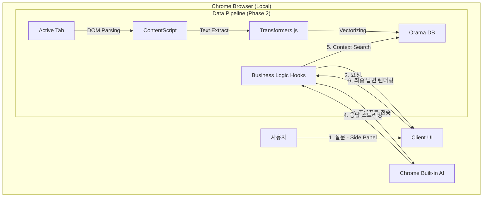

# 🛠️ Project Memex: Technical Specification

> "Local Brain Indexer 구현을 위한 기술 아키텍처 및 설계 명세서"

| 항목 | 내용 |
|------|------|
| 관련 문서 | [PRD.md] |
| 작성일 | 2026-01-05 |
| 작성자 | Frontend Developer |
| 상태 | Draft |

## 1. 시스템 아키텍처 (System Architecture)

전체 시스템은 Chrome Extension 환경 내에서만 동작하며, 외부 네트워크 통신을 차단(Zero-Data Leakage)합니다.



## 2. 기술 스택 선정 (Tech Stack)

### 2.1 Extension Framework: Plasmo

**선정 근거:** React + TypeScript + TailwindCSS 환경을 Zero-config으로 제공하며, HMR(Hot Module Replacement)을 통해 개발 생산성을 극대화함.

**권한 설정:** `sidePanel`, `activeTab`, `scripting`, `storage`

### 2.2 LLM: Chrome Built-in AI (Gemini Nano)

**API:** `LanguageModel` (전역 객체) 또는 `window.ai.languageModel` (레거시)

**API Reference:** https://github.com/webmachinelearning/prompt-api

**선정 근거:**
- **Cost:** 무료 (OpenAI API 비용 절감)
- **Privacy:** 로컬 추론으로 데이터 유출 원천 차단
- **Latency:** 네트워크 레이턴시 없음
- **Features:** 멀티모달 입력, 구조화된 출력, Tool Use 지원

### 2.3 Vector Database (Phase 2): Orama

**선정 근거:** 100% JavaScript로 작성된 검색 엔진으로, WASM 의존성 없이 브라우저 메모리 및 IndexedDB에 최적화됨.

### 2.4 Embedding Model (Phase 2): Transformers.js

**모델:** `Xenova/all-MiniLM-L6-v2` (양자화 버전)

**실행 환경:** WebGPU 가속 활용

## 3. 데이터 모델 설계 (Data Model)

### 3.1 Chat Message (State)

UI에서 관리되는 대화 상태입니다.

```typescript
type Role = 'user' | 'ai' | 'system';

interface Message {
  id: string;           // UUID
  role: Role;
  text: string;
  timestamp: number;
  isThinking?: boolean; // 로딩 상태 표시용
}
```

### 3.2 Memory Document (IndexedDB - Phase 2)

저장소에 영구 보관될 지식 단위입니다.

```typescript
interface MemoryParams {
  id: string;          // UUID
  url: string;         // 원본 URL
  title: string;       // 페이지 제목
  content: string;     // 텍스트 청크 (Chunk)
  embedding: number[]; // 384차원 벡터
  createdAt: number;   // 생성일
}
```

## 4. 핵심 로직 흐름 (Core Logic Flow)

### 4.1 AI 모델 초기화 및 방어 로직 (useGemini Hook)

사용자 환경이 다양하므로 모델 가용성 체크가 필수입니다.

1. **Check API:** `LanguageModel` 전역 객체 또는 `window.ai.languageModel` 존재 여부 확인.
2. **Check Availability:** `availability()` 호출로 상태 확인.
   - `unavailable`: 미지원 (에러 UI)
   - `downloadable`: 다운로드 필요 (`create()` 호출 시 자동 다운로드)
   - `downloading`: 다운로드 진행 중
   - `available`: 즉시 사용 가능
3. **Check Params (선택):** `params()`로 temperature, topK 기본값/최대값 조회.
4. **Create Session:** `create({ initialPrompts, expectedInputs, expectedOutputs })`로 세션 초기화.
5. **Monitor Download:** `monitor` 콜백으로 다운로드 진행상황 추적.

```typescript
// 최신 API 패턴
const availability = await LanguageModel.availability({
  expectedInputs: [{ type: "text" }],
  expectedOutputs: [{ type: "text" }]
})

const session = await LanguageModel.create({
  initialPrompts: [{ role: "system", content: "..." }],
  expectedInputs: [{ type: "text", languages: ["ko", "en"] }],
  expectedOutputs: [{ type: "text", languages: ["ko"] }],
  monitor: (m) => m.addEventListener("downloadprogress", console.log)
})
```

### 4.2 RAG (검색 증강 생성) 파이프라인 (Phase 2)

1. 사용자 질문 입력 ("이 문서 요약해줘").
2. 질문을 Transformers.js로 벡터화.
3. Orama DB에서 코사인 유사도(Cosine Similarity)로 상위 3개 청크 검색.
4. 프롬프트 구성:
   ```
   Context: {검색된 청크 내용}
   Question: {사용자 질문}
   Instruction: 위 Context를 기반으로 답변하세요.
   ```
5. Gemini Nano에 전송 및 응답 출력.

## 5. UI/UX 가이드라인

- **Thinking Indicator:** 로컬 모델 추론 시 약간의 딜레이가 발생할 수 있으므로, "생각 중..." 애니메이션을 반드시 노출.
- **Markdown Rendering:** AI 답변에 포함된 코드 블록이나 리스트를 파싱하여 보여줌.
- **Error Recovery:** 모델이 다운로드되지 않았거나 삭제된 경우, 재다운로드 유도 버튼 제공.
